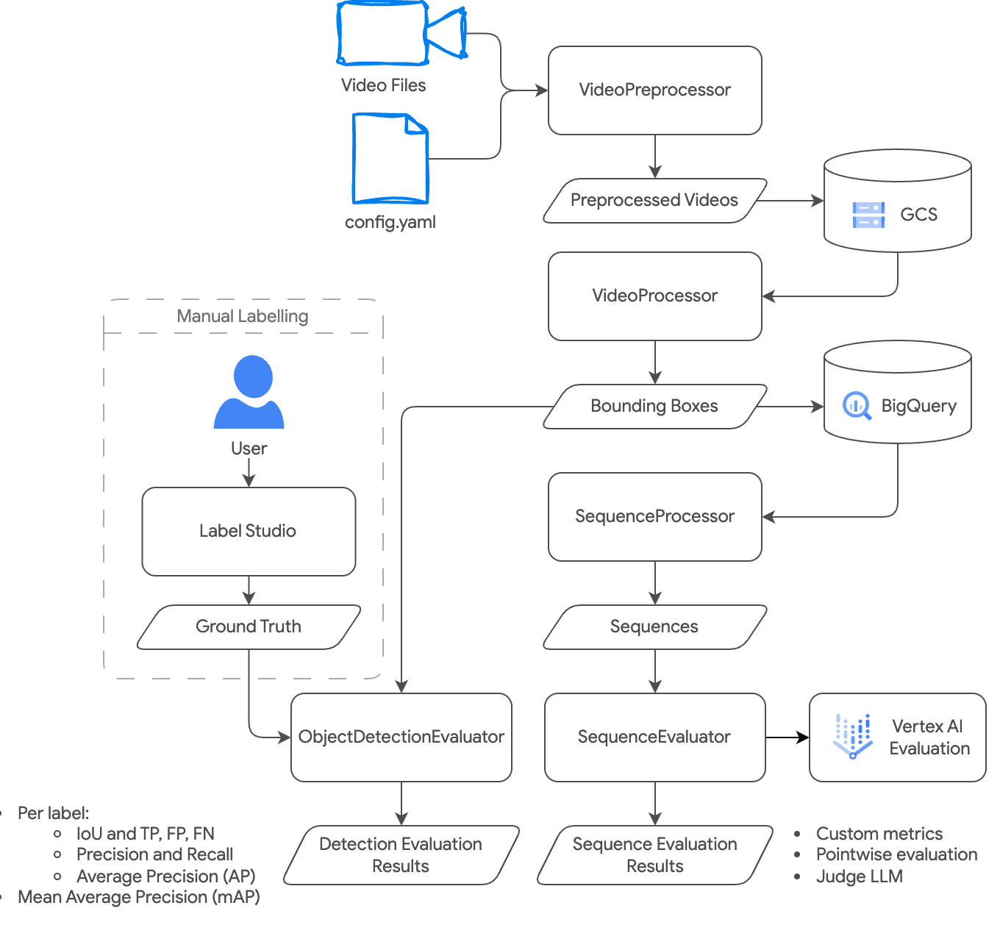

# Gemini Video Intelligence

This repo provides a pipeline for video analysis using Gemini LLM and includes:
- preprocessing
- object detection
- scene understanding
- evaluation
- export

## Workflow

The following diagram illustrates the complete workflow of the video intelligence pipeline:



## Running the Labelling Interface

To label your videos you can use Label Studio python package which gets installed with project dependencies

It can be run simply by typing

```bash
label-studio
```

it should automatically open the browser at localhost:8080

There is a script `video_intelligence/evaluation/convert_ground_truth.py` that can convert labels exported from Label Studio as JSON-MIN into the same format as the LLM response. This converted ground truth should be specified as ground truth file in the config file.

## Running the Pipeline

To run the pipeline, you need to execute the `pipeline.py` script and provide a path to a configuration file.

### Prerequisites

Ensure you have installed the required dependencies using Poetry:

```bash
poetry install
```

### Execution

You should first customize the pipeline's behavior by modifying the `config.yaml` file or by creating your own configuration file based on the provided example.

Then, use the following command to run the pipeline:

```bash
poetry run python video_intelligence/pipeline.py --config config.yaml
```

## Running Individual Steps

For a more granular approach and to visually inspect the results of each step, you can run the pipeline using the provided Jupyter notebooks. The notebooks are numbered to indicate the order of execution:

- `00_eda_and_labelling.ipynb`
- `01_video_preprocessing.ipynb`
- `02_object_detection.ipynb`
- `03_object_detection_evaluation.ipynb`
- `04_scene_understanding.ipynb`
- `05_sequences_evaluation.ipynb`
